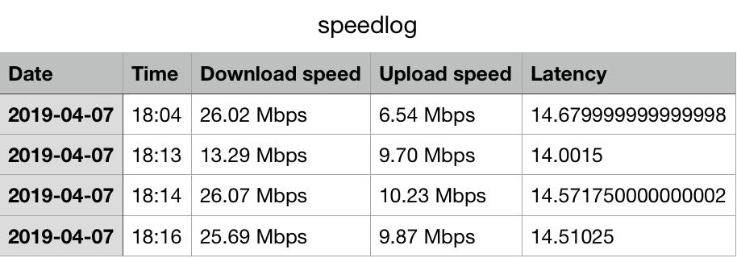

# Speedometer

Speedometer is a simple ruby script that does the following

- Automatically check network speed every 20 minutes
- Log Date, Time, Download rate, Upload rate, and Latency to a csv file
- Send email notification if speed is less than a configurable minimum speed

you can see your speed log in `log/speedlog.csv` updated every n minutes.

  

email notifications look like this.

  

### Prerequisites

- Ruby version 2.2 or higher (Tested on v 2.5.3)
- Postfix - For email notifications
- Cron - For periodicaly executing the script

### Installation

#### 1.Clone this repo

  `$ git clone git@github.com:tonyvince/speedometer.git`

#### 2.Install dependencies

  Go to root `$ cd speedometer` and install dependecies using bundler `$ bundle install`.

  if you see an error `bundle: command not found` then first install bundler `$ gem install bundler`

#### 3.Edit settings

  Open `config/settings.yml` on your favorite text editor to make changes.

  Edit `email_to` - This is the email you will get email notifications.

  Edit `email_from` - This is the email address that will appear as the sender of the notofocation.

  Edit `min_download_rate` - If speed drops below this value, you will get an email notification

#### 4.Change language (Optional)

  To send notifications in a custom language, add a proper translation file in `config/locales`.

  Refer `config/locales/en.yml` and `config/locales/de.yml` for formatting.

  Change to your desired locale on line number 6 of `runner.rb`.

  Ex:- if you want to send emails in Chinese, add a translations file `zh.yml` in `config/locales` directory.
  And change language in `runner.rb` line number 6

  `I18n.default_locale = :zh`

#### 5. Configure postfix to send emails.

  Use postfix to send emails securly

  I. Create a file to store the credentials:

    $ sudo vi /etc/postfix/sasl_passwd

  II. Open the file to edit and add the email host data with the credentials:

    smtp.gmail.com:587 your_username@gmail.com:your_password

  III. Now run:

    $ sudo postmap /etc/postfix/sasl_passwd

  IV. Prepare the postfix main config file:

    $ sudo vi /etc/postfix/main.cf

  V. Add/update these lines

    relayhost = smtp.gmail.com:587
    smtp_sasl_auth_enable = yes
    smtp_sasl_password_maps = hash:/etc/postfix/sasl_passwd
    smtp_use_tls = yes
    smtp_tls_security_level = encrypt
    tls_random_source = dev:/dev/urandom
    smtp_sasl_security_options = noanonymous
    smtp_always_send_ehlo = yes
    smtp_sasl_mechanism_filter = plain

  VI. Check postfix status

    $ sudo postfix status

  VII. If postfix is running already, restart the service to update the configuration

    $ sudo postfix stop && sudo postfix start

  if not, simply start the postfix service `$ sudo postfix start`

  **NOTE - If you are using gmail to send email notifications make sure to [enable less secure apps](https://support.google.com/accounts/answer/6010255) for your account**

#### 6. Schedule the script to run every n minutes.

  By default the script will run every 20 minutes. You can change this in `config/schedule.rb`.

  Refer [here](https://github.com/javan/whenever#example-schedulerb-file) for diffrent scheduling options.

  ##### Update crontab

  run `$ whenever -i` to update the crontab to run the script every n minutes specvified in `config/schedule.rb`

  If you see a confirmation window for permissions, press o.k

  

You are all set 👍

## Troubleshooting

- Check cron log for any errors in the script - `log/cron.log`
- Check postfix emails que for any errors - `$ mailq`
- If you see 'Username and password not accepted' error in your postfix logs, check [this](https://support.google.com/mail/answer/7126229?p=BadCredentials&visit_id=636901414125399742-876647204&rd=2#cantsignin)

## To Do

- Add unit tests.
- Make scheduling intervel easily configurable through settings.
